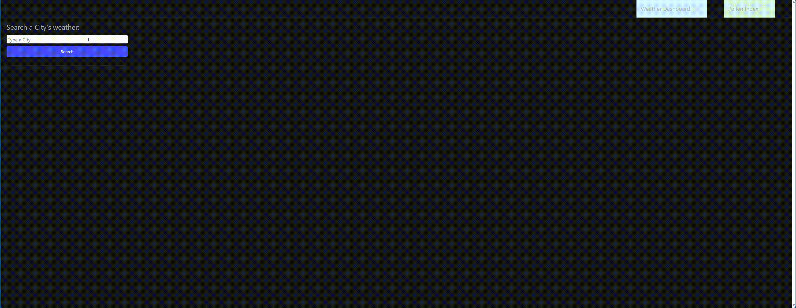

# Pollen Index and Weather Forecast App
This is a simple web application that allows users to check the pollen index and weather forecast for different cities.

## Features

- **Pollen Index**: Users can search for a city's pollen index and view information about the pollen types that are in season, pollen levels and recommended health measures.

- **Weather Dashboard**: Users can search for a city's weather and view the current weather conditions along with a 5-day forecast.

- **Local Storage:** Saves data for previously searched cities to local storage, allowing users to quickly access weather information for their favorite locations.

## Usage
When a user inputs the name of a city in the search input the page will show the types of pollen that are in season, if it's in high or low concentracion as well as the reactiveness of that type of pollen. The data will be stored in local storage to be accessible with a button that will appear with the name of the city.

The user can travel between the weather forecast and pollen index pages. In the weather dashboard page the user can search for a city's name and it will show the weather of that city in the next 3 hours as well as the weather forecast for the next 5 days. The data will be stored in local storage for the user to access it through a button that will apear with the name of the city that was searched.

## Mock-Up

## Installation
There is no installation needed. To access the website [here](https://lolrb.github.io/Pollen-Index/)

## Technologies Used
- **HTML:** Markup language for creating the structure of the web page.
- **CSS (Bulma Framework):** Stylesheet language for styling the web page. Utilizes the Bulma CSS framework for styling.
- **JavaScript:** Programming language for implementing interactive functionality.
- **Google Pollen API:** Provides pollen data for cities around the world, provides more information for regions inside the United States.
- **OpenWeatherMap API:** Provides weather data for cities around the world.

## Files

- `index.html`: HTML file for the weather dashboard.
- `pollen.html`: HTML file for the pollen index page.
- `script.js`: JavaScript file for the weather dashboard functionality.
- `pollen.js`: JavaScript file for the pollen index functionality.

## External Dependencies

- [Bulma CSS](https://bulma.io/): CSS framework used for styling the pages.
- [OpenWeatherMap API](https://openweathermap.org/): API used to retrieve weather data.
- [Google Pollen API](https://developers.google.com/maps/documentation/pollen): API used to retrieve pollen index data.

## Acknowledgements
This project was created as part of a learning exercise and may contain simplistic implementations.